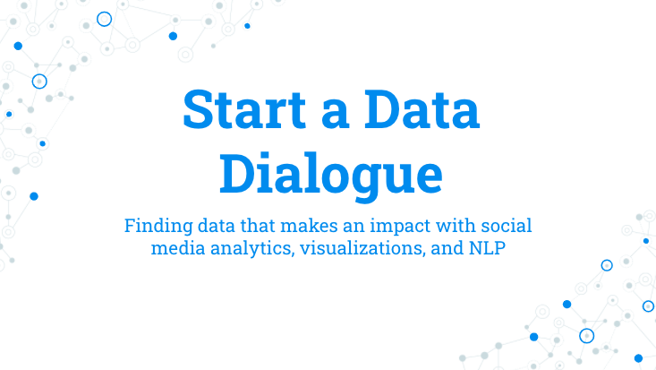
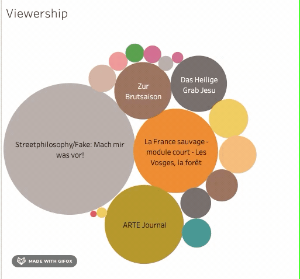
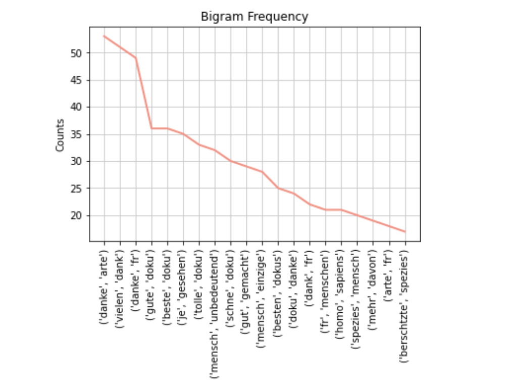
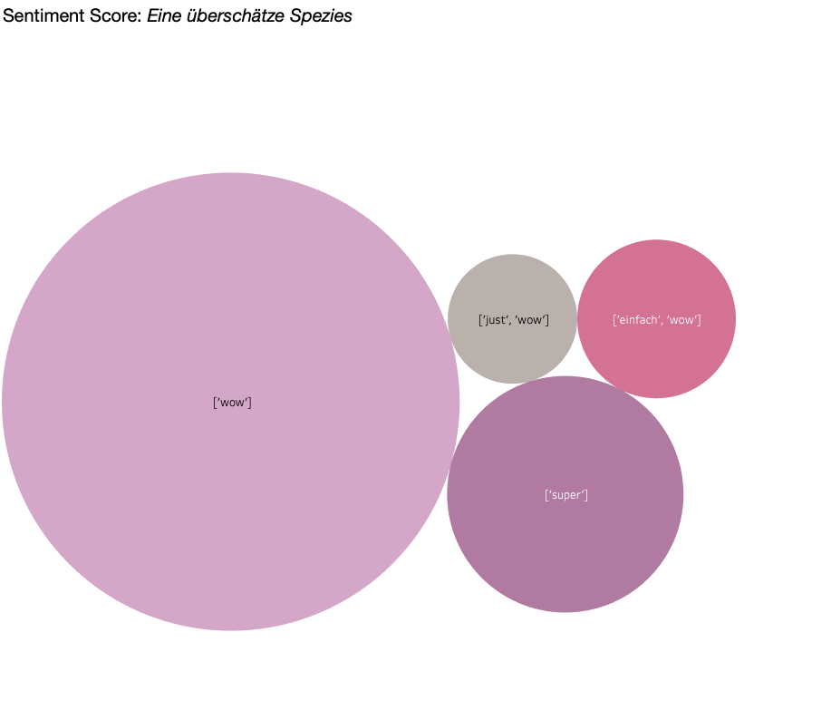
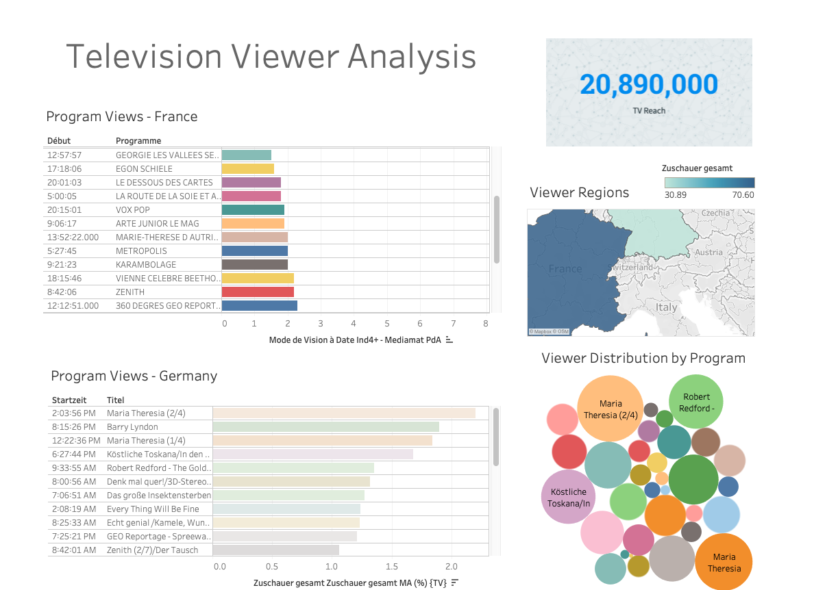

## Description
* A business intelligence dashboard using Tableau  
* A YouTube video metrics analyzer 
  * Channel KPIs such as video count, views, duration, un-/clickable link count and video tags 
* NLP sentiment analysis on YouTube comments  

## Introduction
This was inspired by a project I had previously worked on for a German-French media company as an analyst and consultant to help them make more data-informed decisions. This time, I wanted to take the data possibilities further with the power of Python and machine learning!

I used Python to automate tasks to tidy data, unify it into one stakeholder reporting tool, and to use the data sources available to analyze content performance. I extracted channel and video statistics with the help of the YouTube Data API and performed sentiment analysis to find how viewers felt about videos and content.

### Question
What makes a program a success?

A broadcast company can set itself apart by listening to what your viewers are saying. Machine learning can add value to improve content and uncover viewer sentiment. Natural language processing reveals positive, negative, or neutral attributes.

## Installation and Requirements
You need the YouTube API key for this (I don't include mine) 
https://developers.google.com/youtube/v3/getting-started  
https://console.developers.google.com/

## Viewer Metrics Dashboard

## Sentiment Analysis on YouTube Comments
Bigram to count the frequencies of 2 consecutive words in comments 

## Weighted words in video comments

### Tech Stack
Python, pandas, numpy, sklearn, nltk, vadersentiment,TabPy, Tableau 
